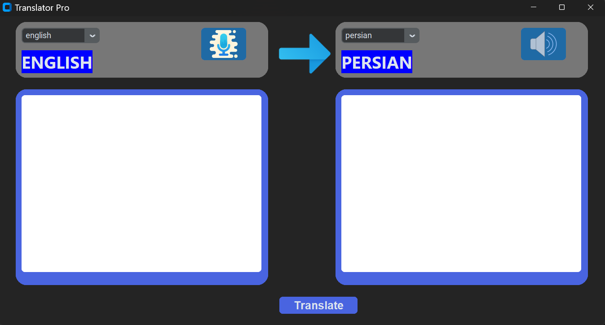

# 🎉 TranslatorPro & HF Model Downloader 📦

Welcome to **TranslatorPro**, your all-in-one desktop translation application built with CustomTkinter, Transformers and Deep Translator! This repository also includes a handy script for downloading SentencePiece and model files from Hugging Face. Dive in to see all the features, installation steps, and usage examples.



---

## 📁 Repository Structure

```

├── hf\_downloader.py       # 🎯 Script to download model files from HF Hub ├── translator\_app.py      # 🖥️ Main TranslatorPro GUI application └── README.md              # 📖 You are here!

````

---

## 🚀 Features Overview

### 1️⃣ HF Model Downloader (`hf_downloader.py`)

- 🔄 **Automatic download** of SentencePiece (`spiece.model`) and other model assets
- 🌐 **Hugging Face** integration via `hf_hub_download`
- 🗂️ **Custom cache directory** for organizing model files

### 2️⃣ TranslatorPro GUI (`translator_app.py`)

- 🎨 **CustomTkinter UI** with dark mode and blue theme
- 🔤 **Multi-language support** using `googletrans` for selecting any of 100+ languages
- 🌐 **Online translation** via `deep_translator.GoogleTranslator`
- 🤖 **Offline translation** using Hugging Face `transformers` pipeline (Helsinki-NLP/opus-mt)
- 🎤 **Speech recognition** powered by `speech_recognition` for voice input
- 🔊 **Text-to-speech** via `pyttsx3` for vocalizing translations
- 🕒 **Auto-clear timer**: prompts every 5 minutes to clear textboxes
- 🔄 **Dynamic labels** updating source/target languages in real time
- ⚠️ **Error handling** with pop-up message boxes for a smooth experience

---

## 🛠️ Installation

1. **Clone the repository**:
   ```bash
   git clone https://github.com/yourusername/TranslatorPro.git
   cd TranslatorPro
   ```

2. **Create a virtual environment** (recommended):

   ```bash
   python -m venv venv
   source venv/bin/activate   # Linux/macOS
   venv\\Scripts\\activate  # Windows
   ```

3. **Install dependencies**:

   ```bash
   pip install -r requirements.txt
   ```

> **requirements.txt** should include:
>
> ```text
> customtkinter
> CTkMessagebox
> deep_translator
> transformers
> pillow
> speechrecognition
> pyttsx3
> googletrans==4.0.0-rc1
> ```

---

## 💡 Usage

### 1. Downloading HF Model Files

```bash
python hf_downloader.py
```

- Adjust `repo_id`, `filename`, and `cache_dir` in script as needed.

### 2. Running TranslatorPro

```bash
python translator_app.py
```

- **Select** source and target languages from the dropdowns
- **Type** or **paste** text into the input box
- Click **Translate** for instant online translation
- Click the **🎤** mic icon to speak (offline translation)
- Click the **🔊** speaker icon to hear the translated text
- Every 5 minutes, a prompt will ask to clear the boxes

---

## 🤝 Contributing

Contributions, issues and feature requests are welcome! Feel free to fork the project and submit a pull request.

---

## 🙏 Acknowledgements

- [Hugging Face](https://huggingface.co/) for model hosting
- [Deep Translator](https://github.com/nidhaloff/deep-translator)
- [CustomTkinter](https://github.com/TomSchimansky/CustomTkinter)


```
```
